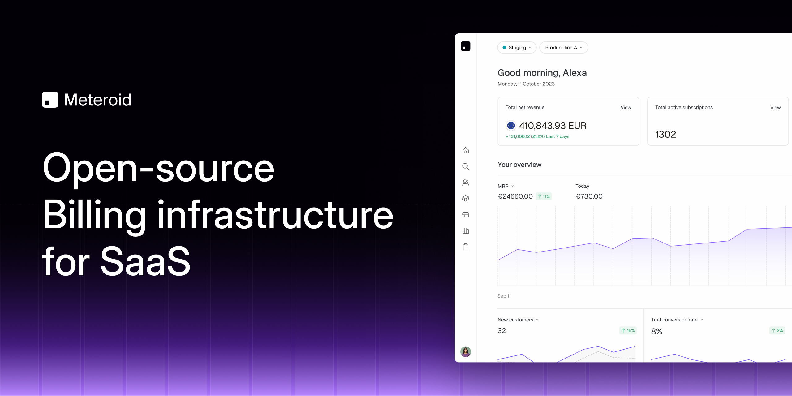
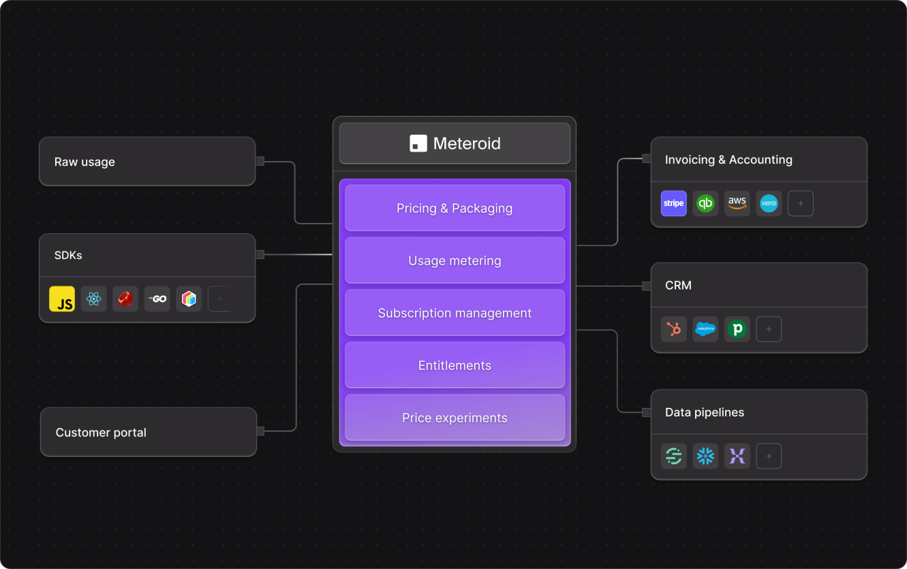

 

  Want to support us ? Leave us a star ⭐ and join us on discord !

 

  <a href="https://www.meteroid.com?utm_source=github" target="_blank">
  <picture>
    <source media="(prefers-color-scheme: dark)" srcset="assets/meteroid-logo-wordmark--dark.svg">
    
  </picture>
  </a>

<h3 align="center">
  Cloud-native pricing and billing infrastructure for product-led SaaS 🔥.
</h3>

 

  
  
  
   
    

Meteroid addresses the complexities and limitations of traditional billing systems, particularly for businesses
transitioning to usage-based models or product-led-growth principles.
It eliminates the gap between customer usage and billing, ensuring accuracy and transparency.

 
**Disclaimer:** This project is in active development.

---

  

<a href="https://meteroid.com/talk-to-us">
  Talk to us !
</a>
 

## How It Works

Meteroid integrates with your existing systems via a simple API, collecting data on customer usage and interactions.
This data fuels the Meteroid billing engine, applying your custom pricing models to generate accurate, timely invoices.

Our platform simplifies the creation, scaling and maintenance of complex billing models, automates invoice generation,
and provides *clear, actionable insights* for achieving your KPIs.

## For whom ?

Meteroid is designed for startups, SMEs, and enterprises looking to embrace some form of usage-based billing,
product-led growth or re-invoicing.

## Build for Sustainable Growth

Our philosophy is deeply rooted in the principles of open source and open startup culture.  
We believe in **transparency** and **collaboration** as foundational pillars that not only foster innovation but also
build trust and community around our mission.

By choosing Rust as our core technology, we leverage its efficiency, reliability, and safety features, ensuring our
platform is built on a solid, secure foundation.

Our focus on Product-Led Growth (PLG) reflects our commitment to creating products that drive user acquisition,
retention, and expansion through their inherent value and user experience

This approach, combined with our open philosophy, guides us toward creating a more inclusive, sustainable future for the
SaaS industries.

## Developer Guide

Please refer to the [contributing guide](CONTRIBUTING.md) for how to install Meteroid from sources.

## Deployment

We provide a Docker Compose and a Helm Chart setup for easy self-hosting:

- **Docker Compose**: See [`docker/deploy`](docker/deploy)  (minimal setup for testing/development)
- **Kubernetes (Helm)**: See [`k8s/meteroid`](k8s/meteroid)

## License

Copyright 2025 Meteroid

Licensed under the AGPL V3 License.   See [LICENSE](LICENSE) for more information.

For enterprise support, addons or custom licensing options, please contact us.

## Contributors ✨

<a href="https://github.com/meteroid-oss/meteroid/graphs/contributors">
  

    
  

</a>

Join us on <a href="https://go.meteroid.com/discord?utm_source=github">Discord</a> !

Thanks for the crazy support 💖
