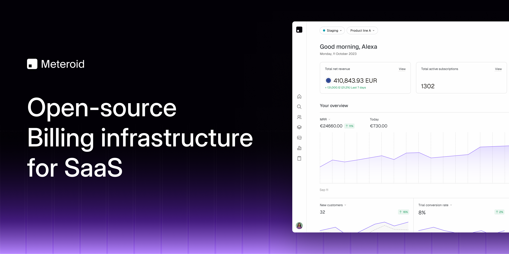
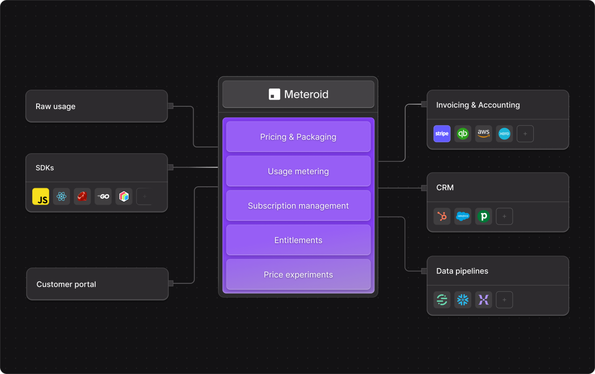

 

  <a href="https://www.meteroid.com?utm_source=github" target="_blank">
  <picture>
    <source media="(prefers-color-scheme: dark)" srcset="assets/meteroid-logo-wordmark--dark.svg">
    
  </picture>
  </a>

<h3 align="center">
  Cloud-native pricing and billing infrastructure for product-led SaaS 🔥.
</h3>

 

  
  
  
   
    

Meteroid addresses the complexities and limitations of traditional billing systems, particularly for businesses
transitioning to usage-based models or product-led-growth principles.
It eliminates the gap between customer usage and billing, ensuring accuracy and transparency.

 

 
  **We'd love your support or contribution! Leave a star ⭐ and join our Discord!**
   

---

  

<a href="https://meteroid.com/talk-to-us">
  Talk to us !
</a>
 

## How It Works

Meteroid integrates with your existing systems via a simple API, collecting data on customer usage and interactions.
This data fuels the Meteroid billing engine, applying your custom pricing models to generate accurate, timely invoices.

Our platform simplifies the creation, scaling and maintenance of complex billing models, automates invoice generation,
and provides *clear, actionable insights* for achieving your KPIs.

## Features

Meteroid is the complete monetization platform for modern SaaS. Key capabilities include:

- [**Usage Metering:**](https://docs.meteroid.com/metering/billable-metrics)
  Transform raw usage events (API requests, tokens, transactions, storage, and more)
  into accurate billable metrics in real time, without pre-aggregation. Powered by Rust
  for high-throughput ingestion at scale.

- [**Pricing & Billing:**](https://docs.meteroid.com/billing/managing-plans)
  Model any pricing structure: flat rate, usage-based, tiered, or hybrid, without
  engineering effort. Plans are versioned, so pricing changes never affect existing
  customers unless you want them to.

- [**Subscription Management:**](https://docs.meteroid.com/subscriptions/what-is-a-subscription)
  Create, manage, and update subscriptions with full lifecycle control: upgrades,
  downgrades, mid-cycle changes, and cancellations.

- [**Quotes (CPQ):**](https://docs.meteroid.com/quotes/introduction)
  Generate and send quotes to close custom deals faster. Once a quote is signed,
  a subscription is created and billing starts automatically, with no manual handovers.

- [**Invoicing & Credit Notes:**](https://docs.meteroid.com/invoices/managing-invoices)
  Automatically generate accurate, detailed invoices, from simple charges to complex
  usage-based and hybrid billing. Issue credit notes when corrections are needed.

- [**Trials, Coupons & Add-Ons:**](https://docs.meteroid.com/billing/managing-trials-and-coupons)
  Drive conversions with trial periods and promotional coupons. Attach add-ons to
  subscriptions to let customers unlock additional capabilities without switching plans.

- [**Customer Management & Self-serve Portal:**](https://docs.meteroid.com/customer/managing-customers)
  Full visibility into your customer base: subscriptions, payment methods, and usage
  history. Give customers a self-serve portal so they can manage their own account
  without contacting support.

- [**Integrations:**](https://docs.meteroid.com/integrations/general-information)
  Connect Meteroid with your existing tools: CRM, accounting, payments, and more.

- [**Insights & Reporting:**](https://meteroid.com/product/insights-and-reporting)
  Monitor your revenue in real time and identify what's driving growth with actionable insights, without waiting
  for month-end exports. *(Coming soon)*

## For whom ?

Whether you're product-led or sales-led, or running both motions at once,
Meteroid is your single source of truth for monetization.

- **Product-led teams** that want to ship usage-based or complex or hybrid pricing from day one,
  without building custom billing infrastructure.
  
- **Sales-led teams** that need to close custom deals fast, automate quote-to-cash,
  and keep finance in sync with no manual handovers between sales and billing.
  
- **Engineering teams** that have been through the pain of building and maintaining a
  billing system from scratch.

## Build for Sustainable Growth

Our philosophy is deeply rooted in the principles of open source and open startup culture.  
We believe in **transparency** and **collaboration** as foundational pillars that not only foster innovation but also
build trust and community around our mission.

By choosing Rust as our core technology, we leverage its efficiency, reliability, and safety features, ensuring our
platform is built on a solid, secure foundation.

Our focus on Product-Led Growth (PLG) reflects our commitment to creating products that drive user acquisition,
retention, and expansion through their inherent value and user experience

This approach, combined with our open philosophy, guides us toward creating a more inclusive, sustainable future for the
SaaS industries.

## Developer Guide

Please refer to the [contributing guide](CONTRIBUTING.md) for how to install Meteroid from sources.

## Deployment

We provide a Docker Compose and a Helm Chart setup for easy self-hosting:

- **Docker Compose**: See [`docker/deploy`](docker/deploy)  (minimal setup for testing/development)
- **Kubernetes (Helm)**: See [`k8s/meteroid`](k8s/meteroid)

## License

Copyright 2026 Meteroid

Licensed under the AGPL V3 License.   See [LICENSE](LICENSE) for more information.

For enterprise support, addons or custom licensing options, please contact us.

## Contributors ✨

<a href="https://github.com/meteroid-oss/meteroid/graphs/contributors">
  

    
  

</a>

Join us on <a href="https://go.meteroid.com/discord?utm_source=github">Discord</a> !

Thanks for the crazy support 💖
